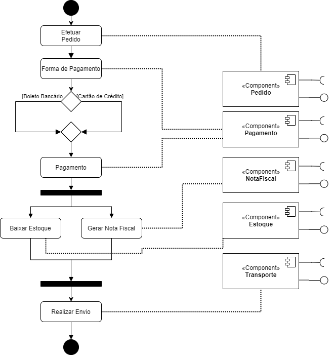
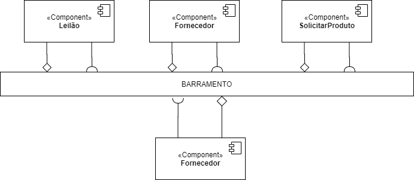
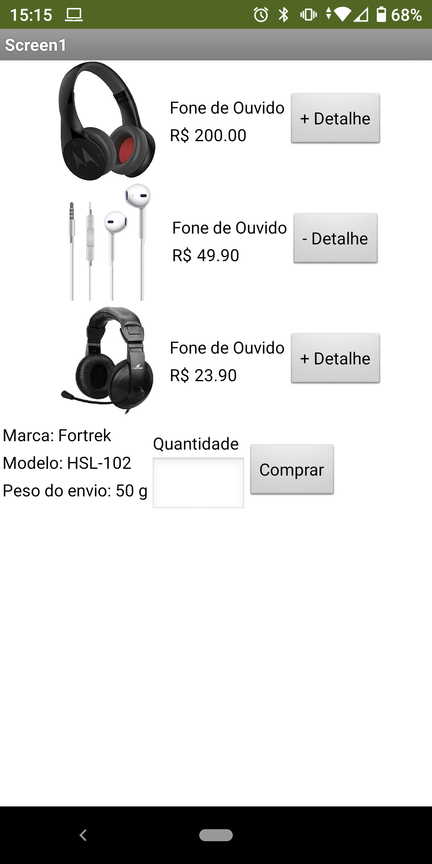
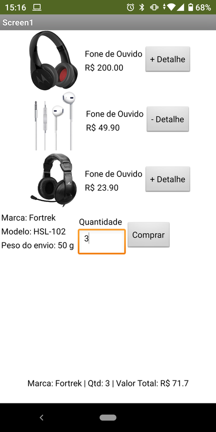
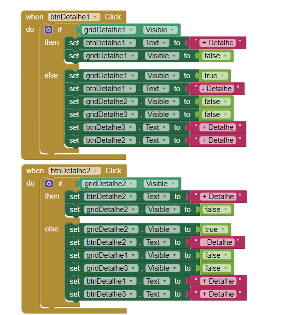
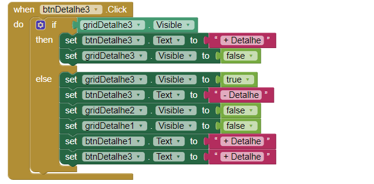
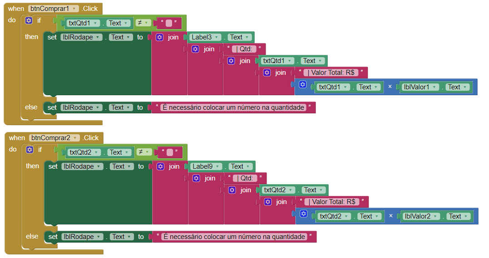
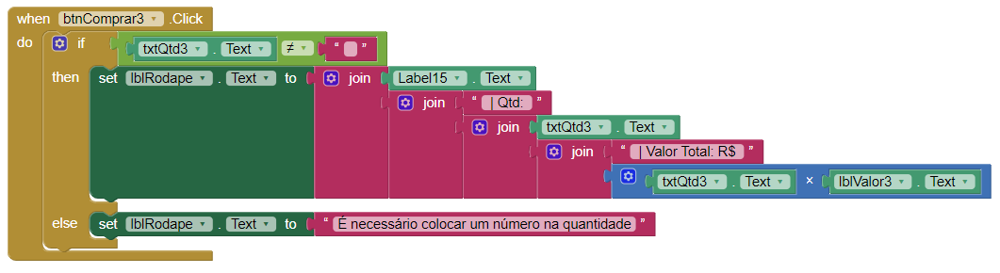

# INF331-2020

# Orquestração e Coreografia

# Lab03 - Model-View-Controller

## Tarefa 1

## Tarefa 2

## Tarefa 3

>  
> 
>> 
> 
> 
> 
> 
> 
> 

[Link para o arquivo do aplicativo](app/Tarefa3.aia)

## Tarefa 4
[Link para o github da Equipe 3](https://github.com/INF331-Grupo3/tarefa4)
