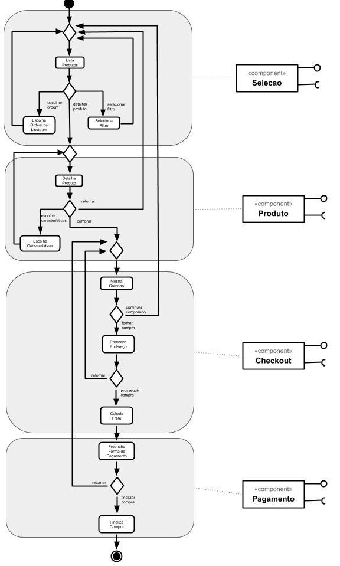
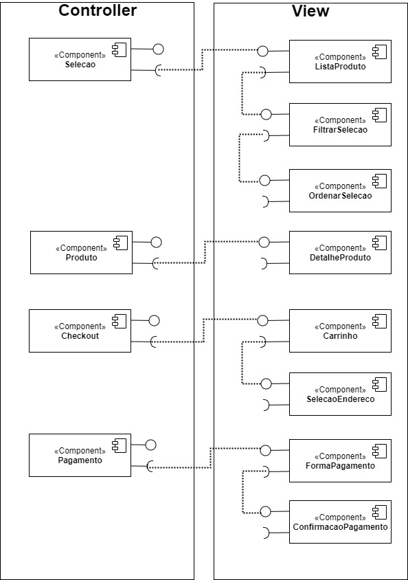
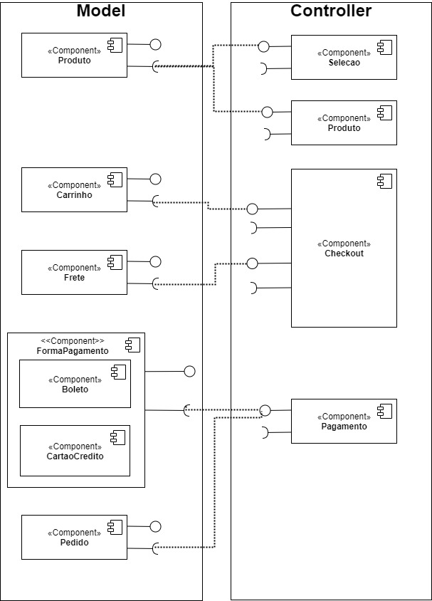

## Tarefa 1
> Coloque a imagem do PNG do seu diagrama como ilustrado abaixo:
> 
> 

## Tarefa 2
> Coloque a imagem do PNG do seu diagrama como ilustrado abaixo:
> 
> 

## Tarefa 3
> Coloque a imagem do PNG do seu diagrama como ilustrado abaixo:
> 
> 

## Tarefa 4

* **Título do serviço**: `Google Geocoding API`
* **Breve descrição**:
  Serviço que transforma um endereço do tipo TEXTO em Coordenadas Geográficas
* **URL completa da requisição**: `https://maps.googleapis.com/maps/api/geocode/json?address=IC+unicamp&key=[MY_GOOGLE_API_KEY]`
* **Cabeçalho HTTP da chamada**:
~~~http
GET /maps/api/geocode/json?address=IC+unicamp&key=[MY_GOOGLE_API_KEY] HTTP/2
Host: maps.googleapis.com
User-Agent: Mozilla/5.0 (Windows NT 10.0; Win64; x64; rv:79.0) Gecko/20100101 Firefox/79.0
Accept: application/json, text/plain, */*
Accept-Language: pt-BR,pt;q=0.8,en-US;q=0.5,en;q=0.3
Accept-Encoding: gzip, deflate, br
Origin: http://localhost:4200
Connection: keep-alive
Referer: http://localhost:4200/
TE: Trailers
~~~
* **Cabeçalho HTTP da resposta**:
~~~http
HTTP/2 200 OK
content-type: application/json; charset=UTF-8
date: Fri, 28 Aug 2020 14:28:45 GMT
pragma: no-cache
expires: Fri, 01 Jan 1990 00:00:00 GMT
cache-control: no-cache, must-revalidate
vary: Accept-Language
access-control-allow-origin: *
content-encoding: gzip
server: mafe
content-length: 647
x-xss-protection: 0
x-frame-options: SAMEORIGIN
server-timing: gfet4t7; dur=397
alt-svc: h3-29=":443"; ma=2592000,h3-27=":443"; ma=2592000,h3-T051=":443"; ma=2592000,h3-T050=":443"; ma=2592000,h3-Q050=":443"; ma=2592000,h3-Q046=":443"; ma=2592000,h3-Q043=":443"; ma=2592000,quic=":443"; ma=2592000; v="46,43"
X-Firefox-Spdy: h2
~~~
* **Conteúdo da resposta**:
~~~json
{
   "results" : [
      {
         "address_components" : [
            {
               "long_name" : "UNICAMP Universidade Estadual de Campinas",
               "short_name" : "UNICAMP Universidade Estadual de Campinas",
               "types" : [ "establishment", "point_of_interest" ]
            },
            {
               "long_name" : "1251",
               "short_name" : "1251",
               "types" : [ "street_number" ]
            },
            {
               "long_name" : "Avenida Albert Einstein",
               "short_name" : "Av. Albert Einstein",
               "types" : [ "route" ]
            },
            {
               "long_name" : "Cidade Universitária",
               "short_name" : "Cidade Universitária",
               "types" : [ "political", "sublocality", "sublocality_level_1" ]
            },
            {
               "long_name" : "Campinas",
               "short_name" : "Campinas",
               "types" : [ "administrative_area_level_2", "political" ]
            },
            {
               "long_name" : "São Paulo",
               "short_name" : "SP",
               "types" : [ "administrative_area_level_1", "political" ]
            },
            {
               "long_name" : "Brasil",
               "short_name" : "BR",
               "types" : [ "country", "political" ]
            },
            {
               "long_name" : "13083-852",
               "short_name" : "13083-852",
               "types" : [ "postal_code" ]
            }
         ],
         "formatted_address" : "UNICAMP Universidade Estadual de Campinas - Av. Albert Einstein, 1251 - Cidade Universitária, Campinas - SP, 13083-852, Brasil",
         "geometry" : {
            "location" : {
               "lat" : -22.8148374,
               "lng" : -47.0647708
            },
            "location_type" : "ROOFTOP",
            "viewport" : {
               "northeast" : {
                  "lat" : -22.8134884197085,
                  "lng" : -47.0634218197085
               },
               "southwest" : {
                  "lat" : -22.8161863802915,
                  "lng" : -47.0661197802915
               }
            }
         },
         "place_id" : "ChIJjTa1SVPByJQRcD1vCXWCcdI",
         "plus_code" : {
            "compound_code" : "5WPP+33 Cidade Universitária, Campinas - SP, Brasil",
            "global_code" : "589J5WPP+33"
         },
         "types" : [ "establishment", "point_of_interest" ]
      }
   ],
   "status" : "OK"
}
~~~
