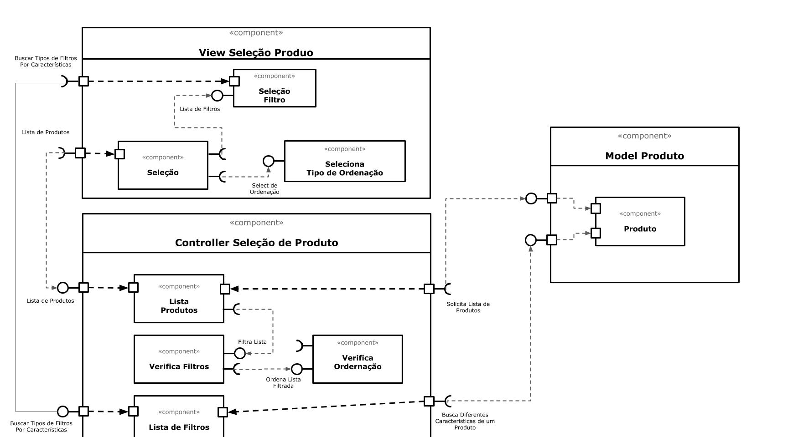

# Modelo para Apresentação do Lab05 - Subcomponentes e Páginas Dinâmicas

Estrutura de pastas:

~~~
├── README.md  <- arquivo apresentando a tarefa
│
└── images     <- arquivos de imagens usadas no documento
~~~

## Tarefa 1

> 

## Tarefa 2
Link para o projeto no Codepen: [Componente Horário](https://codepen.io/mtamashiro/pen/RwaZRym?editors=1000)

>
**HTML**
~~~html

~~~

**JavaScript**
~~~javascript
function Horario(){
  const element = (
    <h2>{new Date().toLocaleTimeString()}</h2>
  );
  // highlight-next-line
  ReactDOM.render(element, document.getElementById('time'));
}

class Header extends React.Component {
  render() {
    let resultado = "";    
    for (let b = 1; b <= this.props.tamanho; b++)
      resultado += '_';    
    return resultado;
  }
}
  
const elemento = 

                   <h2>Horário</h2>
                   <Header tamanho="15"/>
                 

ReactDOM.render(elemento, 
        document.getElementById("header"));

setInterval(Horario, 1000);
~~~
